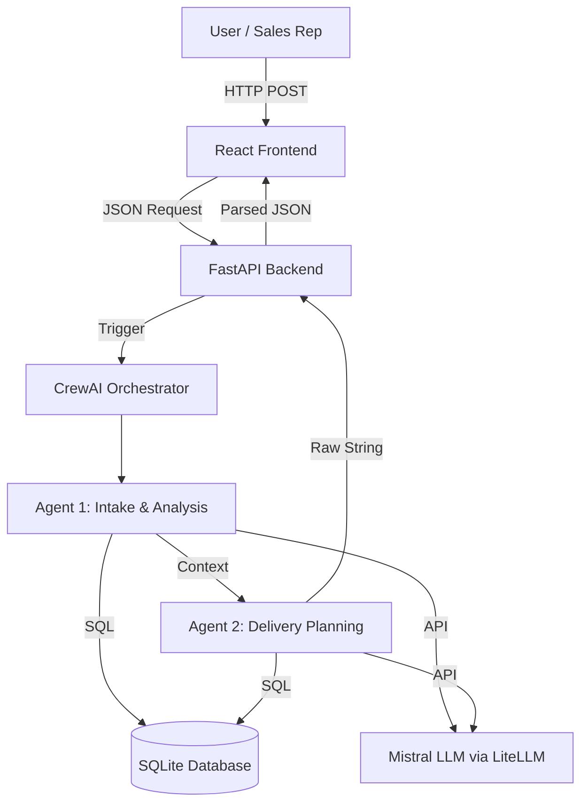

# 🚀 Handoff AI

> An autonomous AI gateway that intercepts and mathematically validates sales contracts against live engineering capacity before they are signed.


---

## ✨ Overview

**Handoff AI** is an enterprise-grade Multi-Agent workflow designed to solve the massive disconnect between Sales and Delivery teams. It uses a sequence of specialized AI agents to autonomously scan incoming sales contracts, detect missing mandatory technical requirements, and cross-reference live engineering databases to ensure the physical capacity exists to deliver the project. 

It guarantees that no impossible or incomplete deal ever reaches a human engineering manager.

---

## 🎯 Problem Statement

**Current Problem → Challenges → Proposed Solution → Expected Benefit**

* **Current Problem:** Sales teams often close deals without capturing mandatory technical requirements or checking if engineers actually have the free time to build the project.
* **Challenges:** Technical leads waste hours deciphering messy sales notes, only to realize the required engineers are already fully booked.
* **Proposed Solution:** Deploy an autonomous AI workflow that intercepts the handoff, strictly validates the data, and checks live SQLite capacity before the deal is approved.
* **Expected Benefit:** 0% contract slippage, elimination of resource overallocation, and zero human bottleneck in the validation phase.

---

## 💡 Solution

Handoff AI solves the Sales-to-Delivery disconnect by placing a dual-agent CrewAI pipeline directly between the Sales UI and the Technical Team. 

When a deal is submitted via the React frontend, it hits a FastAPI backend which awakens the AI Orchestrator. The AI uses custom Python tools to query the live SQLite database, reason about the data using the Mistral LLM, and output a strict, deterministic business decision: whether the deal is safe to hand off, or if it must be blocked due to missing info or busy engineers.

---

## 🔥 Key Features

* 🤖 **Dual-Agent Orchestration** — Uses CrewAI to separate data validation from capacity planning.
* 🧠 **Live Database Tooling** — Agents don't just guess text; they autonomously execute SQL queries against a live `handoff.db` to make mathematical decisions.
* ⚡ **FastAPI Integration** — Blazing fast REST API that bridges the gap between the React frontend and the Python AI logic.
* 📊 **Strict Regex Output** — Ensures the LLM cannot hallucinate by strictly parsing its output against predefined business rules.
* 🌐 **Interactive Glassmorphism UI** — A beautiful, recruiter-friendly React frontend that visualizes the AI's internal thoughts in real-time.

---

## 🧠 How It Works

User Input (React UI)  
↓  
FastAPI Server (`api.py`)  
↓  
CrewAI Orchestrator (`crew.py`)  
↓  
Intake Agent queries SQLite (`agents.py` & `tools.py`)  
↓  
Delivery Agent checks live capacity  
↓  
Mistral LLM makes deterministic risk assessment  
↓  
FastAPI returns JSON Result  

---

## 🏗️ System Architecture



---

## 🤖 AI / Agent Architecture

This project is not a chatbot; it is a **Multi-Agent System** powered by CrewAI.

* **Agent 1: Intake & Analysis Agent**
  * *Responsibility:* Fetches the raw deal from the database and mathematically ensures no mandatory fields (budget, timeline, tech stack) are missing.
  * *Tools:* `get_deal_details`, `check_requirements`
* **Agent 2: Delivery Planning Agent**
  * *Responsibility:* Receives the validated data from Agent 1, queries the live engineer roster, and assesses project risk based on physical resource availability.
  * *Tools:* `check_resource_availability`, `create_project_handoff`, `escalate_to_manager`

Agents communicate sequentially. Agent 1 executes its tasks and passes its contextual memory directly to Agent 2.

---

## 🔄 Complete Workflow

1. User clicks a button in the React UI to evaluate a deal.
2. React sends a JSON POST request to the FastAPI backend.
3. FastAPI triggers `crew.kickoff()`.
4. The **Intake Agent** uses a Python tool to fetch the deal from SQLite.
5. Mistral LLM analyzes the deal for missing info.
6. The validated summary is passed to the **Delivery Agent**.
7. The Delivery Agent uses a Python tool to query the live `resources` SQL table.
8. Mistral LLM cross-references the required skills against engineer availability.
9. Mistral outputs a strict decision (e.g., "Expert is not available.").
10. FastAPI parses the string, packages it into JSON, and returns it to React.

---

## 🛠️ Tech Stack

| Category | Technology | Purpose |
| :--- | :--- | :--- |
| **Language** | Python | Core Backend Logic |
| **Backend** | FastAPI | High-performance REST API |
| **Frontend** | React (Babel/Tailwind) | Interactive User Interface |
| **AI Framework** | CrewAI | Multi-Agent Orchestration |
| **LLM Connector** | LiteLLM | Seamless API Translation |
| **LLM Provider** | Mistral AI | Core Reasoning Engine |
| **Database** | SQLite | Live State & Data Persistence |

---

## 📂 Project Structure

```text
handoff-ai/
│
├── api.py               # The FastAPI entry point
├── agents.py            # AI Persona definitions & LLM binding
├── tasks.py             # Specific instructions for each Agent
├── crew.py              # CrewAI sequential orchestrator
├── tools.py             # Python functions wrapped as AI @tools
├── database.py          # SQLite schema and mock data generation
├── prompts.py           # System prompts and business rules
│
├── frontend/
│   ├── index.html       # HTML wrapper for React
│   └── app.jsx          # The React frontend interface
│
├── requirements.txt     # Python dependencies
├── .env.example         # Environment variable template
└── README.md            # You are here
```

* **`api.py`** → Bridges the web browser to the AI logic via REST.
* **`crew.py`** → The manager that forces Agent 1 to finish before Agent 2 starts.
* **`tools.py`** → The crucial link that allows the LLM to interact with the real physical database.

---

## ⚙️ Installation

### 1. Clone repository
```bash
git clone https://github.com/raghu4350/handoff-ai.git
cd handoff-ai
```

### 2. Create virtual environment
**Windows:**
```bash
python -m venv venv
venv\Scripts\activate
```
**Linux/macOS:**
```bash
python3 -m venv venv
source venv/bin/activate
```

### 3. Install dependencies
```bash
pip install -r requirements.txt
```

---

## 🔐 Environment Variables

This project requires a Mistral AI API key to power the LLM reasoning engine. Create a `.env` file in the root directory:

```env
MISTRAL_API_KEY=your_mistral_api_key_here
```
*(You can get a free API key from the [Mistral Console](https://console.mistral.ai/))*

---

## ▶️ Running the Project

**1. Start the FastAPI AI Backend:**
```bash
uvicorn api:app --reload --port 8501
```

**2. Start the Frontend:**
Simply open `frontend/index.html` in your web browser (or use a live server extension). The frontend is configured to automatically communicate with `localhost:8501`.

---

## 🖥️ Usage

When you open the web application, you will see a list of mocked deals pulled from SQLite. 

**Example Interaction:**
1. Click **"Test High Risk"** on a deal.
2. The UI will show a live loading state as the Agents process the request.
3. **Output:** The UI immediately blocks the deal, displaying a red warning: `"Expert is not available."` because the AI successfully queried the database and found the required engineer was busy.

---

## 🌐 API Endpoints

| Method | Endpoint | Purpose |
| :--- | :--- | :--- |
| `POST` | `/api/handoff/evaluate` | Triggers the CrewAI workflow to evaluate a deal |
| `GET` | `/api/deals` | Fetches all sales deals from SQLite |
| `GET` | `/api/records` | Fetches the live engineer capacity roster |

---

## 📡 Example API Request

```bash
curl -X POST http://localhost:8501/api/handoff/evaluate \
-H "Content-Type: application/json" \
-d '{"client_name":"TechCorp"}'
```

---

## 📊 Example Output

```json
{
  "status": "Incomplete message. Deal is cancelled.",
  "risk_level": "High"
}
```

---

## 🎯 Use Cases

* **IT Consultancies:** Prevent sales teams from selling React projects when all React developers are booked.
* **SaaS Companies:** Ensure custom enterprise requirements (like SSO or on-premise deployment) are strictly documented before the engineering team is notified.
* **Agency Operations:** Automatically estimate project risk before signing binding contracts.

---

## 💼 Business Impact

* **Eliminates Manual Work:** Engineering Managers no longer spend 4 hours reading messy sales notes.
* **Prevents Resource Overallocation:** Mathematically ensures deals are only approved if physical capacity exists.
* **Standardizes Workflows:** Forces all sales deals into a strict, validated format.

---

## ⭐ What Makes This Project Interesting

1. **Deterministic AI:** Instead of relying on an LLM to guess an answer, this project forces the LLM to execute raw Python SQL queries, ensuring mathematically perfect capacity planning.
2. **True Autonomy:** The system doesn't require a human to click "approve". The AI pipeline makes the final routing decision autonomously.
3. **Beautiful Abstraction:** It abstracts complex backend AI orchestration behind a single, ultra-fast FastAPI endpoint that any modern frontend can consume.

---

## 🚀 Future Improvements

* **Authentication:** Implement JWT-based auth for recruiters.
* **Salesforce Integration:** Replace the SQLite mock data with live Salesforce API Webhooks.
* **Slack Simulation:** Automatically ping a Slack channel if a deal is marked "High Risk".
* **PostgreSQL:** Migrate from local SQLite to a cloud Postgres database.

---

## 🔒 Security

* All API keys are strictly managed via `.env` files and excluded via `.gitignore`.
* **CORS Restrictions:** The FastAPI backend restricts access to authorized frontend origins.
* **SQL Injection Prevention:** All Python tools use parameterized queries `(?, (client_name,))` to prevent malicious database manipulation by the LLM or User.

---

## 🤝 Contributing

Contributions, issues, and feature requests are welcome! Feel free to check the issues page if you want to contribute.

---

## 📜 License

This project is currently open-source and available for educational and interview-demonstration purposes.

---

## 👨‍💻 Author

**Raghuveer Singh**  
*B.Tech Computer Science & Engineering — Data Science*

* **GitHub:** [@raghu4350](https://github.com/raghu4350)
* **LinkedIn:** [Raghuveer Singh](https://linkedin.com/in/your-linkedin-profile) *(Add your link here)*
* **Email:** your.email@example.com *(Add your email here)*

---

> If you found this project useful, consider giving the repository a ⭐.
