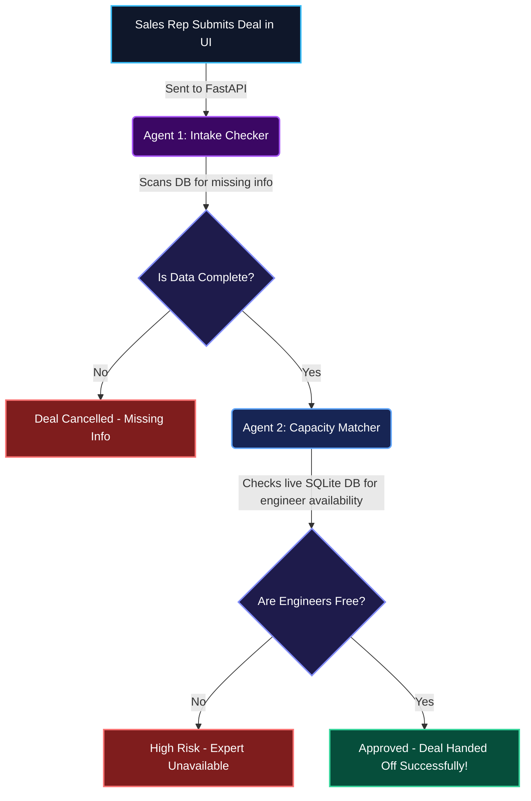

# 🚀 Handoff AI (Enterprise Edition)
**Autonomous AI Gateway for Sales-to-Delivery Workflows**


---

## 🛑 The Core Problem
In most IT agencies, there is a massive gap between the **Sales Team** (who want to close deals as fast as possible) and the **Delivery Team** (who actually have to write the code). 

This gap causes massive business failures:
- **Missing Information:** Deals are closed without defining a budget or specific requirements.
- **Resource Blindness:** Sales sells an iOS app project when all the iOS developers are busy for the next 6 months.
- **Unrealistic Scopes:** Promising massive features in impossible 2-week timelines.
- **Ruined Reputations:** Having to cancel a deal or delay a project immediately after signing it makes the company look highly unprofessional.
- **Wasted Tech Time:** Senior engineers waste hours every week reading messy sales notes instead of building software.

## 💡 The Solution
**Handoff AI** intercepts this broken process using an autonomous AI pipeline. Before a deal is officially handed over to the tech team, our AI pipeline reads the messy sales contract, queries the live engineering database, and mathematically proves whether the deal is safe to take or too risky to sign.

---

## 🗺️ How It Works (The Pipeline)



---

## 🤖 The AI Agents Explained (In Simple Terms)

This project uses **CrewAI** to manage multiple AI workers (agents). We use the **Mistral AI** LLM to power their brains. 

Instead of one AI trying to do everything, we split the job into two specialized workers:

### 🕵️‍♂️ Agent 1: The Intake Agent (The Checker)
**What it does:** It looks at the messy, raw notes from the salesperson.
**Its goal:** It ensures that no mandatory fields are missing. It checks if there is a budget, a timeline, and a clear project type. If *anything* is missing, it instantly halts the process and cancels the deal until the information is provided.

### 👷‍♂️ Agent 2: The Delivery Agent (The Planner)
**What it does:** Once the data is verified, this agent looks at the live company database (SQLite). 
**Its goal:** It finds out exactly what kind of engineers are needed for the project (e.g., Python, React, iOS). Then, it checks if those specific engineers actually have free time right now. If the engineers are booked, it flags the deal as **High Risk**. If they are free, it officially approves the handoff!

---

## 🏗️ Codebase Architecture & Tech Stack

This project is built using a modern, fully decoupled architecture:

1. **The Brains (CrewAI + Mistral LLM)**
   - We use the `mistral/open-mistral-nemo` model for fast, highly accurate reasoning.
   - The agents are given specific **Tools** (Python functions) that allow them to query the database directly. They don't guess—they look up real data.

2. **The Backend (FastAPI + Python)**
   - A lightning-fast Python server that routes requests from the frontend, triggers the AI agents, and manages the database connections.

3. **The Frontend (React.js + Tailwind CSS)**
   - A stunning, highly interactive single-page application (SPA). It uses glassmorphism design, real-time feedback, and dynamic routing to look professional and premium.

4. **The Database (SQLite)**
   - A persistent, real-time database that stores:
     - Engineer availability and skills.
     - Deal history (Approved, Cancelled, Escalated).

---

## 🚀 How to Run Locally

1. **Install Requirements**
   ```bash
   pip install -r requirements.txt
   ```

2. **Add API Key**
   Create a `.env` file in the root directory and add your Mistral API Key:
   ```env
   MISTRAL_API_KEY=your_key_here
   ```

3. **Start the Server**
   ```bash
   uvicorn api:app --reload --port 8501
   ```

4. **Open the App**
   Navigate to `http://localhost:8501` in your browser.
